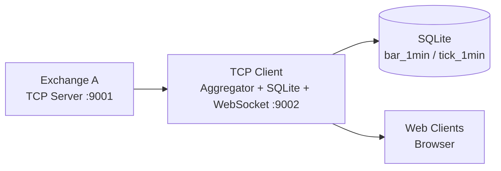

# MarketBridge (TickTunnel)

一个以 C++ 实现的模拟交易所与中间处理层的端到端流式系统：
- 交易所 A（TCP Server，9001）每秒随机选取 100–300 个品种（S0001…S1000），每品种推送 2 次行情帧。
- 中间层 B（TCP Client + 聚合 + DB + WebSocket，9002）校验签名、聚合同秒与分钟数据、入库 SQLite，并通过 WebSocket 推送前端表格。

## 功能特性
- HMAC-SHA256 帧级签名与校验，保障链路认证与完整性。
- 每秒按“同一品种同一秒内两帧”进行秒级聚合（OHLC+成交量累加）。
- 按 60 秒滚动进行分钟级聚合（分钟内多个秒级条目融合为 1 条）。
- SQLite 持久化：`tick_1min`（保留）与 `bar_1min`（分钟K线）。
- WebSocket 实时推送，前端表格动态展示最新分钟条目。
- 连接与并发稳定性：A 端使用 `asio::strand` 串行化写队列，B 端逐行读取避免签名误判。

## 目录结构
```
TickTunnel/
├── CMakeLists.txt
├── server_a.cpp        # 交易所 A：TCP Server + 行情生成 + 帧签名
├── server_b.cpp        # 中间层 B：TCP Client + 聚合 + SQLite + WebSocket/HTTP
├── web/
│   └── index.html      # 前端页面（表格订阅 WebSocket）
└── build/              # 构建输出目录（VS 工程、exe、db等）
```

## 架构说明
- 数据流：`Exchange-A (TCP Server)` → `Middle-B (TCP Client)` → `聚合/入库` → `WebSocket 推送` → `Web 前端`
- 安全：A 与 B 共享密钥，A 对每帧做 HMAC-SHA256，B 校验签名通过后才处理。
- 周期：A 每秒随机 100–300 个品种，每品种 2 帧；B 在同秒聚合，分钟切换时写入分钟表并广播。

### 架构图（Mermaid）


### 架构图（ASCII）
```
+----------------------+      TCP (signed frames)       +---------------------------------------------+
|  Exchange A (9001)   |  --------------------------->   |  Middle B: TCP Client + Aggregator + WS     |
|  generate ticks      |                                 |  - verify HMAC                             |
|  sign per frame      |                                 |  - second merge + minute aggregate         |
+----------------------+                                 |  - SQLite (bar_1min / tick_1min)           |
                                                         |  - WebSocket :9002                         |
                                                         +--------------------------+------------------+
                                                                                | WS broadcast
                                                                                v
                                                                      +-------------------+
                                                                      |    Web page       |
                                                                      |  table (index.html)|
                                                                      +-------------------+
```

## 通信协议
- 帧格式（单帧单行，`\n` 结尾）：
  ```
  {"symbol":"S0001","open":1.17775,"high":1.17801,"low":1.17773,
   "close":1.17792,"volume":1895,"ts":1751625253}|sig:<64位hex>\n
  sig = HMAC_SHA256(secret="exchange-a-secret", message=JSON字符串)
  ```
- 字段定义：
  - `symbol`：品种（`S0001…S1000`）
  - `open/high/low/close`：价格（double，保留 5 位）
  - `volume`：成交量（int）
  - `ts`：秒级时间戳（int64，UTC秒）

## 聚合规则
- 同秒（两帧）→ 秒级条目：
  - `open` = 第一帧的 `close`
  - `high/low` = 两帧极值
  - `close` = 第二帧的 `close`
  - `volume` = 两帧累加
- 分钟聚合（分钟内多个秒级条目）：
  - `open` = 分钟内第一个秒级条目 `open`
  - `high/low` = 分钟所有秒级条目的极值
  - `close` = 分钟最后一个秒级条目 `close`
  - `volume` = 分钟内所有秒级条目成交量累加
- 分钟切换：将上分钟所有 `symbol` 的分钟条目写入 `bar_1min` 并通过 WebSocket 广播。

## 数据库
- 文件：默认在工作目录生成 `tick_1min.db`
- 表结构：
  - `tick_1min(symbol TEXT, ts INT, open REAL, high REAL, low REAL, close REAL, volume INT)`
  - `bar_1min(symbol TEXT, ts INT, open REAL, high REAL, low REAL, close REAL, volume INT)`
- 建议：为 `bar_1min(symbol, ts)` 建索引，便于查询（可后续扩展）。

## 构建与运行（Windows）
- 依赖（示例路径见 `CMakeLists.txt`）：Boost、OpenSSL、websocketpp、SQLite3
- 构建：
  - `cmake -S . -B build`
  - `cmake --build build --config Debug`
- 运行：
  - 启动 A：`build/Debug/server_a.exe`
  - 启动 B：`build/Debug/server_b.exe`
  - 浏览器访问：`http://127.0.0.1:9002/`

## 稳定性与容错
- A 端：`asio::strand` 串行化写队列，消除并发竞争导致的偶发崩溃。
- B 端：逐行读取，剔除签名尾部空白，稳定 HMAC 校验；读失败自动重连；环形队列高水位丢帧。

## 前端
- `web/index.html` 订阅 `ws://127.0.0.1:9002/ws`，接收分钟条目并在表格中更新。
- `ts` 将在前端以本地时间格式化显示。

## 后续可扩展
- 认证握手：TCP 建连时增加 challenge/response，区分认证与签名校验。
- 回压与限速：按水位/CPU/延迟做动态节流或丢弃策略。
- 历史视图：前端加载 `bar_1min` 历史，支持筛选与分页。